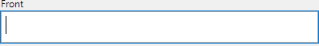
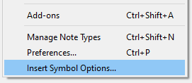
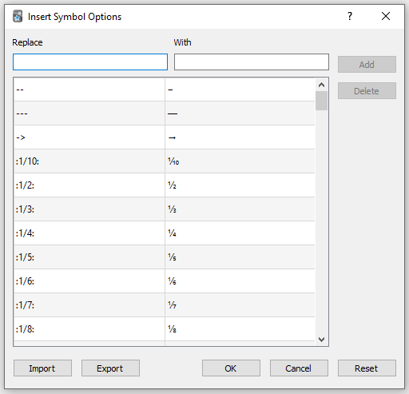

# Symbols As You Type

This Anki plugin lets you quickly insert Unicode symbols into cards by typing a predefined key sequence.

### Getting Started:
----
1. Install the plugin from [AnkiWeb](https://ankiweb.net/shared/info/2040501954) (plugin ID: 2040501954).
2. For a list of available symbols, open the Options window (see below) or refer to the [list of default symbols](https://github.com/jefdongus/insert-symbols-anki-addon/wiki/List-of-Default-Symbols).

### Features:
----
- Large variety of symbols including Greek letters, mathematical characters, currency, and more.
- Symbol list is fully customizable and is synced to AnkiWeb per profile.
- Compatible with Anki 2.0 and 2.1

### Adding Your Own Symbols:
----
The symbol list is fully customizable, and you can add, import, and export your own list of symbols through the Options window. To open the Options window, click on the `"Insert Symbol Options..."` item in the `Tools` menu. If the plugin was just installed, you may need to restart Anki for the menu to show up:

This should bring up the following window:

### License:
----
This plugin is licensed under the GNU Affero General Public License version 3, same as Anki.
